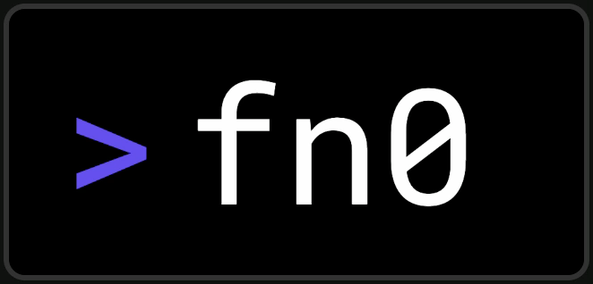

# fn0

**fn0** is an open-source application platform inspired by Cloudflare Workers.

It provides serverless compute using **Wasmtime and V8**, together with platform services such as transactional data storage, object storage, WebSockets, queues, secrets, and OpenTelemetry-based observability.

Applications can run directly on fn0, or use **Forte**, the full-stack Rust + React framework built on top of it.

This repository is the main monorepo for the fn0 platform. In addition to fn0 itself, it contains **Forte** and **dodb**, a transactional document/KV database developed for fn0.

**fn0** is pronounced `f-n-zero`.

## Projects

### fn0

**fn0** is the core FaaS runtime and cloud platform.

It runs:

- WebAssembly components through [Wasmtime](https://wasmtime.dev/)
- JavaScript and TypeScript through a V8-based WinterCG runtime

fn0 provides the execution environment as well as the platform services applications commonly need around it.

Applications can use fn0 directly without using Forte.

[fn0 Platform Overview](docs/fn0/overview.md)

### Forte

**Forte** is a full-stack Rust + React framework built on fn0.

It adds a higher-level application model including server-rendered React pages, APIs, server actions, WebSockets, background tasks, type generation, local development tooling, and deployment workflows.

Forte server code runs on fn0, while fn0 itself remains usable independently.

[Forte Overview](docs/forte/overview.md)  
[Forte Quick Reference](docs/forte/quick-reference.md)

### dodb

**dodb** is a transactional document/KV database developed for fn0.

Its logical key space is based on `(tenant, pk, sk)` with opaque byte values. It provides optimistic transactions, a B+Tree storage engine, redo WAL and crash recovery, group commit, a QUIC protocol, and a first-party Rust client.

fn0 exposes a backend-neutral document database API to applications; dodb is the database backend used by the fn0 platform without exposing dodb-specific storage details to application code.

[dodb Architecture Overview](dodb/docs/architecture/00-overview.md)

## Platform Capabilities

fn0 is more than an isolated function runtime. It provides a set of application-facing platform services around compute.

### Compute

- **Rust / WebAssembly**
  - WASI 0.3 Component Model
  - executed with Wasmtime
- **JavaScript / TypeScript**
  - executed with V8
  - WinterCG-style runtime
  - no Node.js compatibility
- HTTP request handling
- streaming request and response bodies
- WebSockets
- persistent singleton WebSocket connections
- background queues and cross-project invocation
- local development through the CLI
- managed deployment through fn0 Cloud

### Database

fn0 provides applications with a document-oriented database interface supporting:

- `get`
- `put`
- `delete`
- partition queries
- scans
- optimistic concurrency
- atomic conditional multi-item transactions

The application-facing database API is **backend-neutral**.

Application code talks to fn0's semantic document API rather than directly depending on the physical database implementation. This lets the platform choose or replace the backing database without exposing its connection details or storage protocol to applications.

fn0 Cloud currently uses **dodb** as its transactional document/KV database backend.

### Object Storage

fn0 provides private and public object storage through an application-facing storage API.

It supports:

- put / get / head / delete
- prefix listing
- streaming uploads and downloads
- presigned URLs
- public objects served through a CDN
- cache invalidation

Application code does not need access to storage credentials or the physical storage endpoint. fn0 routes and signs storage requests outside the application.

The storage layer works with **S3-compatible object storage**, allowing the physical object-storage backend to be selected independently of application code.

### Observability

fn0 has built-in **OpenTelemetry** support for:

- traces
- metrics
- application logs
- platform logs and metrics

Applications export telemetry through the standard OTLP boundary rather than depending directly on a particular observability database.

The current fn0 Cloud telemetry pipeline is:

```text
Application / fn0 Worker
          │
         OTLP
          │
       collecty
    durable queue
          │
         Signy
          │
    Cloudflare R2
```

This keeps the application-facing observability interface based on OpenTelemetry while allowing the storage and processing backend to evolve independently.

### Platform Abstraction

A recurring design principle in fn0 is that applications should depend on **platform capabilities**, not infrastructure-specific credentials and endpoints.

For example:

```text
Application
    │
    ├── Document Database API ──────→ dodb / sqlite, turso, DynamoDB, etc.
    │
    ├── Object Storage API ─────────→ S3-compatible storage
    │
    ├── OpenTelemetry / OTLP ───────→ Signy / telemetry backend
    │
    └── Compute APIs ───────────────→ Wasmtime / V8
```

The implementations on the right are infrastructure choices. Application code primarily interacts with the stable interfaces on the left.

## Features

- Run WebAssembly components using WASI 0.3 and the Component Model.
- Run JavaScript and TypeScript using the V8-based fn0 JavaScript runtime.
- Develop and run applications locally using the CLI.
- Deploy directly to fn0 or build applications with the Forte framework.
- Use managed fn0 Cloud instead of operating the platform yourself.
- Use built-in transactional document storage.
- Use S3-compatible private and public object storage.
- Generate presigned URLs for direct object upload and download.
- Use HTTP and persistent WebSocket connections.
- Run queue tasks and cross-project operations.
- Store application secrets outside application code.
- Export traces, metrics, and logs through OpenTelemetry.
- Self-host the platform and choose infrastructure implementations independently from application-facing APIs.

## fn0 Cloud Limits

These limits apply to fn0 Cloud. Self-hosted deployments can configure different limits.

- Request
  - Header: 128 KB
  - Body: 100 MB
- Response
  - Header: 128 KB
  - Body: Unlimited
- Memory: 128 MB
- CPU Time: 50 ms
- Duration: 15 secs
- Subrequests: 50 requests
  - Subrequests are external internet requests.

See [Limits & Quotas](docs/fn0/limits.md) for more details.

## Supported Languages

- Rust
- JavaScript
- TypeScript

Rust applications run as WebAssembly components.

JavaScript and TypeScript run in fn0's V8-based WinterCG environment. Node.js compatibility is not provided.

## Example Applications

- REST API servers
- Server Side Rendering (SSR)
- full-stack web applications with Forte
- image resizing and media processing
- WebSocket applications
- background jobs
- applications using transactional document storage
- applications serving files through object storage and CDN

## Deployment and Infrastructure

fn0 separates application-facing APIs from much of the infrastructure behind them.

The current fn0 Cloud deployment uses:

- **Oracle Cloud Infrastructure (OCI)** for compute infrastructure
- **Cloudflare** for CDN and edge integrations
- **S3-compatible storage** for object and bundle storage
- **dodb** for transactional document/KV storage
- **OpenTelemetry + collecty + Signy** for observability

Self-hosted deployments can provide their own infrastructure behind the platform interfaces.

## Supported Code Storage Providers

fn0 can load application code from:

- File System
  - including shared filesystems such as NFS
- S3-compatible object storage

## Not Supported Features

### Multi-threaded guest execution

fn0 currently executes each guest instance on a single worker thread.

Use async/await for concurrency instead of creating guest threads.

WASI guest threading may be supported in the future as the relevant WebAssembly and WASI threading standards mature.

## Handler Contract

fn0 reuses a single WebAssembly instance — and, for JavaScript deployments, a single V8 isolate — to serve many concurrent requests on the same worker thread, similar to the Cloudflare Workers execution model.

Your handler code must respect this:

- **Handlers must be effectively stateless across requests.**
  Do not rely on module-level mutable state to carry information between requests; another request may be interleaved on the same instance at any `await` point.

- **Shared state must be safe under interleaved requests.**
  If shared mutable state is used, it must remain safe when multiple requests make progress on the same worker thread.

- **Do not assume a fresh environment per request.**
  Module-level initialization runs once. Per-request setup belongs inside the handler.

fn0 does not enforce this contract at runtime. Violating it can produce request-level data leakage or inconsistent behavior.

## Architecture

At a high level:

```text
                         Applications
                              │
                ┌─────────────┴─────────────┐
                │                           │
             Forte                       raw fn0
        full-stack framework             applications
                │                           │
                └─────────────┬─────────────┘
                              │
                             fn0
                    compute + platform APIs
                              │
             ┌────────────────┼─────────────────┐
             │                │                 │
          Database       Object Storage    Observability
             │                │                 │
            dodb       S3-compatible         OTLP
                           storage              │
                                             Signy
```

fn0 Cloud consists of a control plane and a worker pool.

Workers execute application code, enforce runtime limits, provide platform services to guests, and cache compiled application bundles for warm execution.

The platform also includes infrastructure for:

- load balancing and autoscaling
- blue-green worker deployment
- bundle storage and caching
- WebSocket routing
- database routing
- object-storage request signing and routing
- secrets
- telemetry collection and forwarding

See [fn0 Platform Overview](docs/fn0/overview.md) for the current implementation details.

## Repository Structure

This repository contains the major fn0 projects together with the crates and infrastructure used to implement them.

```text
fn0/
├── fn0/              fn0 runtime, worker, CLI, control plane, and supporting components
├── forte/            Forte framework, SDK, CLI, code generation, and tooling
├── dodb/             Transactional document/KV database
├── doc-db/           Application-facing document database implementation
├── object-storage/   Application-facing object storage implementation
├── infra/            fn0 Cloud infrastructure
├── docs/             Platform and framework documentation
└── vendor/           Vendored dependencies required by the platform
```

The directories above do not correspond one-to-one with public products. Many internal crates exist to implement the three major projects: **fn0, Forte, and dodb**.

For the detailed Rust workspace layout, see [Crate Overview](docs/crate-overview.md).

## Documentation

### fn0

- [Platform Overview](docs/fn0/overview.md)
- [Limits & Quotas](docs/fn0/limits.md)
- [Platform Deployment](docs/fn0/deployment.md)

### Forte

- [Forte Overview](docs/forte/overview.md)
- [Quick Reference](docs/forte/quick-reference.md)
- [Project Structure](docs/forte/project-structure.md)
- [CLI Reference](docs/forte/cli.md)

### dodb

- [Architecture Overview](dodb/docs/architecture/00-overview.md)
- [Architecture](dodb/docs/architecture/)
- [Operations](dodb/docs/operations/)
- [Architecture Decision Records](dodb/docs/adr/)

### Repository Development

- [Documentation Index](docs/README.md)
- [Crate Overview](docs/crate-overview.md)
- [Development Workflow](docs/development.md)

# License

This project is licensed under the GNU Affero General Public License v3.0 (AGPL v3).

If you want to use this software for proprietary commercial purposes without the open-source obligations (e.g., keeping your source code closed), you can purchase a Commercial License.

Please contact us at [projectluda@gmail.com](mailto:projectluda@gmail.com) for licensing inquiries.
